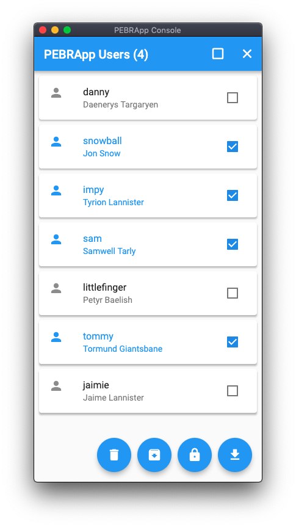
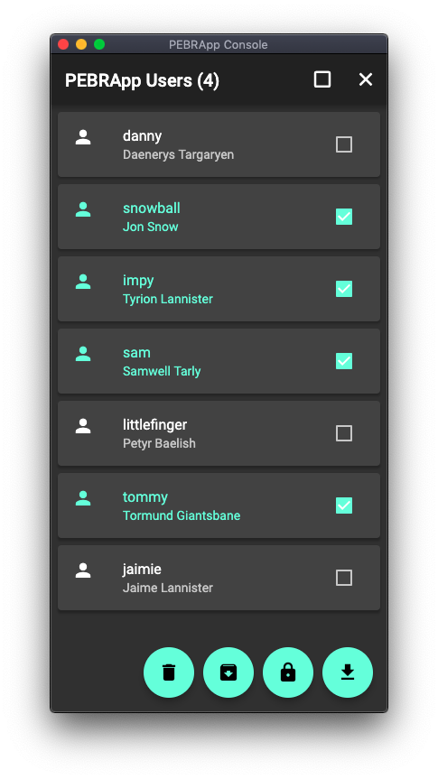

# PEBRApp Console


This is an administrative tool to help manage the PEBRApp users and data (see [PEBRApp repository](https://github.com/chrisly-bear/PEBRApp)). It is designed for desktop, but there's also a mobile variant on the `mobile` branch.

 

## Configure

The app accesses the data on [SWITCHtoolbox](https://toolbox.switch.ch). You need to set the proper values for the variables in `lib/config/switch_config.dart` for the app to work.

## Build and Run

The app is built with Flutter, Google's cross-platform UI toolkit. To build and run the app, you need to have the Flutter SDK installed (see https://flutter.dev/docs/get-started/install). At the time of writing, Flutter does not have built-in support for building desktop applications, so the project uses [Flutter Desktop Embedding](https://github.com/google/flutter-desktop-embedding) to achieve the same. For this to work, you must be on the Flutter **master channel** (`flutter channel master`) and have **desktop support enabled** (`flutter config --enable-macos-desktop`). Then you should see desktop (e.g. `macOS`) as a target platform (run `flutter devices` to check). See [flutter-desktop-embedding README](https://github.com/google/flutter-desktop-embedding/blob/master/README.md) and [Flutter Wiki](https://github.com/flutter/flutter/wiki/Desktop-shells) for more details.

Once you have desktop support ready, you can run the app with:

```bash
flutter run
```

If you want to specify a device to run the app on (check devices with `flutter devices`), use the `-d` argument:

```bash
# runs the app on desktop (macOS in this case)
flutter run -d macOS
```

### Troubleshooting

If you're getting a build error when running on macOS, run `pod install` from the `macos/` directory.

The most recent version of Flutter on the master branch might be incompatible with the desktop embedding project files, which will lead to a build error. In that case, you can try to check out a specific commit of Flutter which used to work:

```bash
# go to your Flutter SDK directory
cd flutter
# the following commit should work
git checkout 500d7c50df4d794a92305d6ffe1ee10387faed43
# go to the PEBRApp Console project
cd PEBRApp-Console/
# build Flutter
flutter packages get
```

## Release

At the time of writing, Flutter Desktop Embedding does not support release builds. However, you can still distribute a debug version of the app. Follow these steps to create a deployable macOS application:

1. Open the Xcode project: `open macos/Runner.xcworkspace`
2. From the Xcode menubar select *Product → Archive*. Once the process completes, the Archive window should open.
3. In the Archive window, select *Distribute App*, then *Copy App*. Click *Next*, then set the name to 'PEBRApp Console' and select the directory where you want the app to be created.

## License

This project is licensed under the MIT license (see the [LICENSE](LICENSE) file for more information).

The app logo is exempt from this license and is **under copyright by Technify** (http://technifyls.com/).
