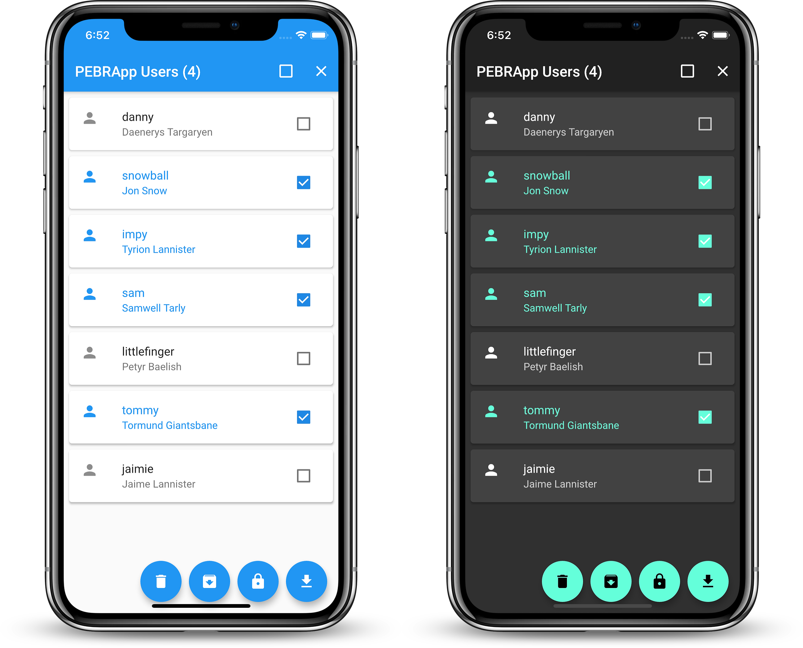

[](https://github.com/chrisly-bear/PEBRApp-Console/blob/mobile/LICENSE)

# PEBRApp Console (desktop)


This is an administrative tool to help manage the PEBRApp users and data (see [PEBRApp repository](https://github.com/chrisly-bear/PEBRApp)). This is the desktop version, there is also a mobile version on the `mobile` branch.



## Configure

The app accesses the data on [PEBRAcloud](https://github.com/chrisly-bear/PEBRAcloud). You need to set the proper values for the variables in `lib/config/pebracloud_config.dart` for the app to work.

## Build and Run

The app is built with Flutter, Google's cross-platform UI toolkit. To build and run the app, you need to have the Flutter SDK installed (see https://flutter.dev/docs/get-started/install). Then run the app with:

```bash
flutter run
```

If you want to specify a device to run the app on (check devices with `flutter devices`) use the `-d` argument:

```bash
# runs the app on the Android emulator with ID 5554
flutter run -d emulator-5554
```

## Release

To make a deployable apk file, simply run:

```bash
flutter build apk
```

You may want to follow the steps at https://flutter.dev/docs/deployment/android#signing-the-app to create a signed apk. Also, to reduce the size of the apk, you can build it specifically for one architecture (such as ARM) by running:

```bash
# creates a smaller apk which runs on ARM devices only
flutter build apk --target-platform android-arm --split-per-abi
```

You can build for other target platforms by using one (or several) of `android-arm64`, `android-x86`, `android-x64` as the `--target-platform` parameter.

## License

This project is licensed under the MIT license (see the [LICENSE](LICENSE) file for more information).

The app logo is exempt from this license and is **under copyright by Technify** (http://technifyls.com/).
